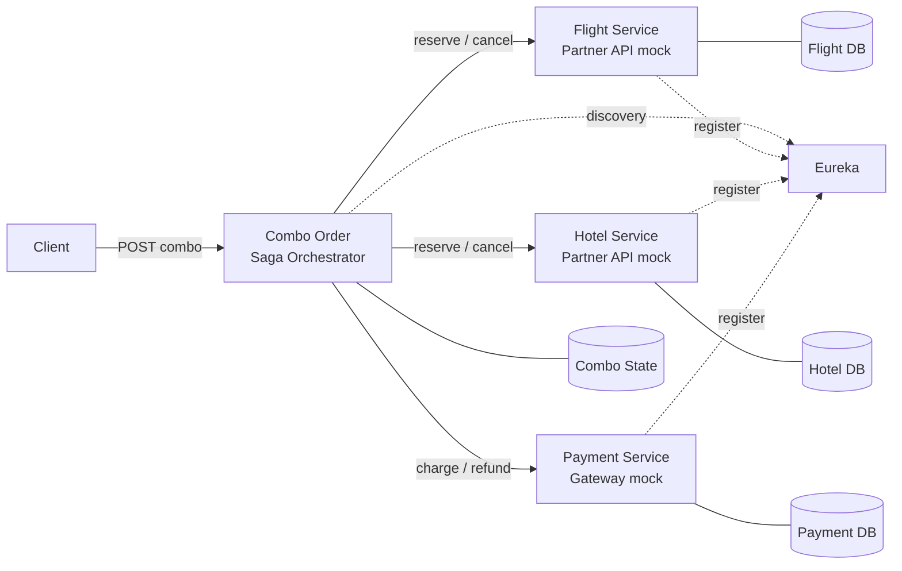
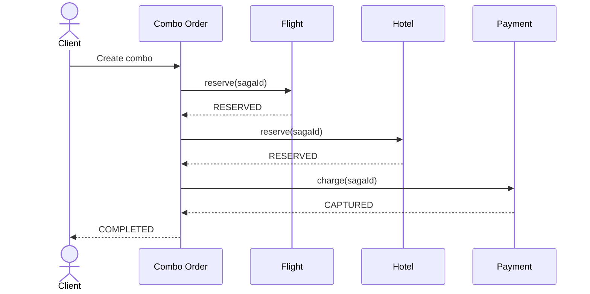
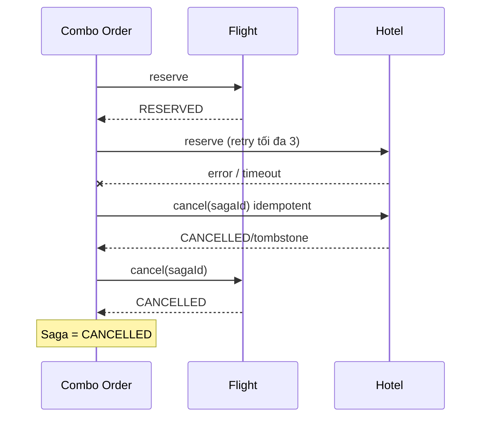
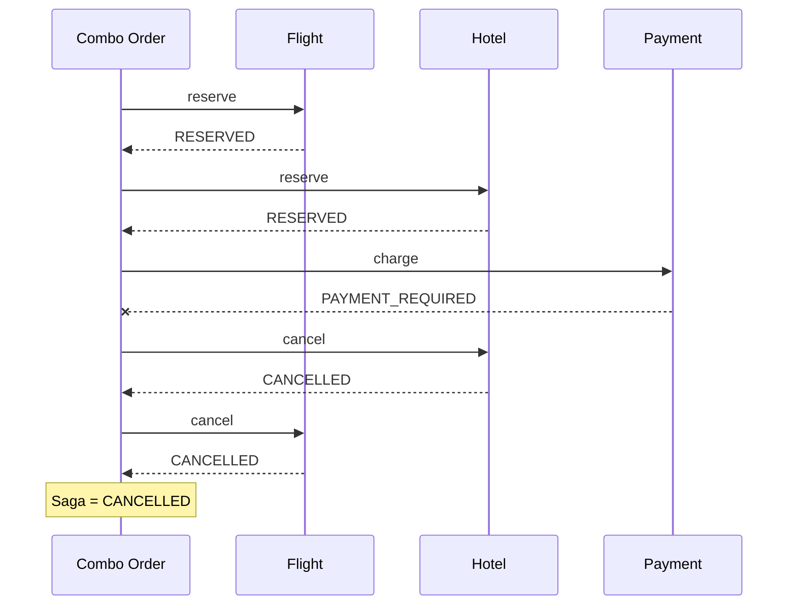

# HỒ SƠ THIẾT KẾ KIẾN TRÚC

## Hệ thống đặt vé combo "Chuyến đi trọn gói"

**Mẫu kiến trúc:** Saga Orchestration  
**Công nghệ mô phỏng:** Java 21, Spring Boot, OpenFeign, Eureka, REST mock  
**Phạm vi giao dịch:** Vé máy bay + Phòng khách sạn + Thanh toán

---

## 1. Bài toán và ràng buộc

Khách hàng đặt vé máy bay và phòng khách sạn trong một yêu cầu combo. Về nghiệp vụ, combo chỉ được xác nhận khi cả Flight, Hotel và Payment đều thành công; nếu một bước thất bại, các bước đã hoàn thành phải được bù trừ.

Flight và Hotel là hai đối tác độc lập, dùng API và cơ sở dữ liệu riêng. Payment cũng quản lý giao dịch riêng. Vì vậy hệ thống không thể mở một transaction ACID/2PC dùng chung. Giải pháp đảm bảo **eventual consistency** bằng chuỗi local transaction và compensating transaction.

### Dịch vụ tham gia

| Dịch vụ | Trách nhiệm | Dữ liệu sở hữu |
|---|---|---|
| Combo Order | Nhận yêu cầu, lưu trạng thái Saga, điều phối và ghi trace | ComboOrder, sagaId, trạng thái |
| Flight | Giữ/hủy vé máy bay | Flight reservation |
| Hotel | Giữ/hủy phòng | Hotel reservation |
| Payment | Thu/hoàn tiền | Payment transaction |
| Eureka | Service discovery | Registry (hạ tầng, không thuộc transaction) |

## 2. Luồng đặt combo và điểm thất bại

1. Combo Order tạo bản ghi `PENDING` và `sagaId` duy nhất.
2. Gọi Flight giữ chỗ. Có thể lỗi hết vé, HTTP 5xx, mất kết nối hoặc timeout.
3. Gọi Hotel giữ phòng. Có thể hết phòng, HTTP 5xx, timeout hoặc response thất lạc.
4. Gọi Payment thu tiền. Có thể bị từ chối, timeout hoặc kết quả không chắc chắn.
5. Nếu tất cả thành công, chuyển order sang `COMPLETED`.
6. Nếu có lỗi, chuyển `COMPENSATING`, chạy bù trừ theo thứ tự ngược, rồi thành `CANCELLED`.

Các lỗi hạ tầng khác cần tính đến trong production: orchestrator restart giữa Saga, lệnh trùng do retry, compensate thất bại, dữ liệu trạng thái chưa kịp persist và đối tác xử lý thành công nhưng response bị mất.

## 3. Lựa chọn Saga Orchestration

Chọn **Orchestration** vì luồng combo có thứ tự rõ ràng, các API đối tác không phát chung một chuẩn sự kiện và yêu cầu rollback phụ thuộc bước đã hoàn thành. `ComboSagaOrchestrator` giữ state machine và quyết định lệnh kế tiếp/bù trừ.

So với Choreography, lựa chọn này giúp quan sát một `sagaId` từ đầu đến cuối, tập trung timeout/retry, dễ chứng minh bốn kịch bản lỗi và tránh để Flight/Hotel/Payment biết logic của toàn bộ combo. Đổi lại orchestrator là thành phần quan trọng, cần persistence, HA và outbox/inbox khi triển khai production.

## 4. Kiến trúc module



Mỗi service chỉ sửa dữ liệu của mình. Mọi request nghiệp vụ mang `sagaId` làm idempotency key. Project demo dùng `ConcurrentHashMap`; production thay bằng database riêng cho từng service.

## 5. Giao dịch thuận và bù trừ

| Bước thuận | Trạng thái sau bước | Compensate | Tính idempotent |
|---|---|---|---|
| Flight.reserve | FLIGHT_RESERVED | Flight.cancel(sagaId) | Reserve trả booking cũ; cancel lặp vẫn CANCELLED |
| Hotel.reserve | HOTEL_RESERVED | Hotel.cancel(sagaId) | Reserve trả booking cũ; cancel lưu tombstone |
| Payment.charge | PAYMENT_COMPLETED | Payment.refund(sagaId) | Charge trả payment cũ; refund lặp vẫn REFUNDED |
| Xác nhận combo | COMPLETED | Đổi Combo thành CANCELLED khi rollback | State theo sagaId |

Compensate chạy theo thứ tự ngược: Payment → Hotel → Flight. Riêng lỗi/timeout Hotel, orchestrator vẫn gửi `Hotel.cancel(sagaId)` dù chưa nhận được response thành công, vì timeout tạo ra kết quả không chắc chắn. Tombstone `cancelledSagas` ngăn request Hotel đến trễ tạo “ghost booking”.

## 6. Sơ đồ trình tự

### 6.1 Thành công



### 6.2 Hotel thất bại hoặc timeout



### 6.3 Payment thất bại



## 7. Timeout, retry và phục hồi

### Chính sách demo

- Hotel connect timeout: 1 giây.
- Hotel read timeout: 2 giây.
- Retry tối đa 3 lần, backoff từ 200 ms đến 1 giây.
- Mock `HOTEL_TIMEOUT` xử lý 5 giây nên client hết thời gian chờ.
- Sau khi hết retry, orchestrator gửi cancel Hotel và Flight.

### Nguyên tắc áp dụng

Chỉ retry lỗi tạm thời như connect/read timeout, HTTP 502/503/504; không retry lỗi nghiệp vụ như hết phòng hoặc thanh toán bị từ chối. Mọi request phải có idempotency key. Dùng exponential backoff có jitter để tránh retry storm. Timeout tổng phải nằm trong deadline của request khách hàng.

Nếu compensate lỗi, trạng thái chuyển `COMPENSATION_FAILED`; production ghi durable command vào outbox, worker retry riêng và đưa vào DLQ/cảnh báo vận hành khi quá ngưỡng. Không được đánh dấu `CANCELLED` trước khi các compensate bắt buộc hoàn tất.

## 8. State machine và quan sát

```text
PENDING -> FLIGHT_RESERVED -> HOTEL_RESERVED -> PAYMENT_COMPLETED -> COMPLETED
   |              |                 |                    |
   +--------------+-----------------+--------------------+
                          lỗi
                           v
                     COMPENSATING
                       /       \
              CANCELLED       COMPENSATION_FAILED
```

Mỗi response của Combo Order chứa `sagaId`, trạng thái, các reservation ID, lý do lỗi và `trace`. Log/metric production nên gắn `sagaId`/correlation ID; theo dõi tỷ lệ thành công, latency từng đối tác, số retry, số compensate và tuổi của Saga chưa kết thúc.

## 9. Bốn kịch bản chứng minh

| Input scenario | Kết quả | Bằng chứng trong trace |
|---|---|---|
| SUCCESS | COMPLETED | Flight reserved → Hotel reserved → Payment captured |
| HOTEL_FAILURE | CANCELLED | Hotel lỗi → Hotel cancel idempotent → Flight cancel |
| PAYMENT_FAILURE | CANCELLED | Payment lỗi → Hotel cancel → Flight cancel |
| HOTEL_TIMEOUT | CANCELLED | Hotel timeout sau retry → Hotel cancel/tombstone → Flight cancel |

Các request có sẵn trong `demo.http`; script `scripts/demo.sh` chạy tuần tự cả bốn trường hợp.

## 10. Lưu ý khi đưa lên production

Demo cố ý dùng REST đồng bộ và in-memory để dễ quan sát. Phiên bản production nên persist Saga state, dùng transactional outbox/inbox, message broker cho command bù trừ, circuit breaker, bulkhead, authentication giữa service, mã hóa dữ liệu nhạy cảm, reconciliation job và dashboard/alert. Chính sách hủy thực tế cũng cần xét phí phạt của đối tác và thời hạn giữ chỗ.

## 11. Kịch bản quay video demo

1. Giới thiệu sơ đồ module và state machine trong hồ sơ.
2. Mở Eureka, xác nhận bốn service nghiệp vụ đã đăng ký.
3. Chạy `SUCCESS`, chỉ ra trạng thái `COMPLETED` và ba ID.
4. Chạy `HOTEL_FAILURE`, chỉ ra trace bù Hotel/Flight và `CANCELLED`.
5. Chạy `PAYMENT_FAILURE`, chỉ ra thứ tự hủy Hotel rồi Flight.
6. Chạy `HOTEL_TIMEOUT`, chờ retry và giải thích tombstone chống booking đến trễ.
7. Kết luận hệ thống đạt eventual consistency, đồng thời nêu giới hạn in-memory của bản demo.

